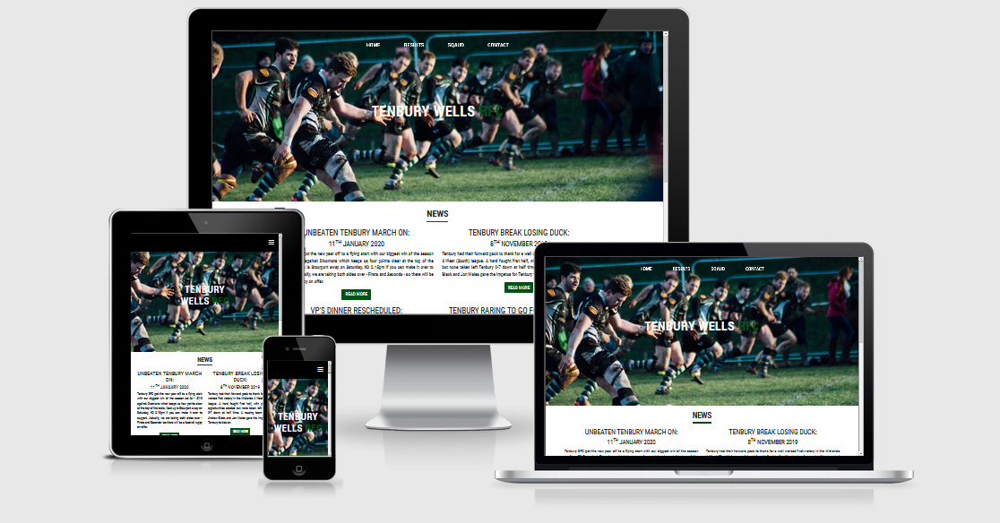

# Tenbury Wells RFC - Milestone 1 Project


---

This project is for my local rugby team based in Tenbury Wells, they currently use a generic Pitchero site like many other clubs around them. The goal of this project is to make the club standout with their own site, aswell as providing clear information for users, such as upcoming fixtures and results, club news, squad detials and include contact detials for any interested players, fans or sponsors.

## UX

### User Goals

I expect that the majority of the users will fall into the following criteria:

- Be a player or coach from either Tenbury Wells RFC or a rival club
- Be a supporter of the team
- A local player looking to join the team

### User Stories

- As a user I want to view the latest club news, so that I can keep myself updated with the latest club news.
- As a user I want to see the league table and results, so that I can see how the team is performing.
- As a user I want to see the season fixtures, so that I can plan on attending the games.
- As a user I want to be able to contact coaches, so that I can inquire about joining the team.
- As a user I want the wesbite to both be visually appealing and easy to navigate, so I can easily find information and navigate to different pages.
- As a user I want to be able to view the current squad, so that I can see what positions the team might need and see who is in the current squad.

### Wireframes

[Here](https://github.com/filleben/TenburyWellsRFC/tree/master/assets/wireframes/initial-designs) are initial designs I made for the site.

When I was making the site I made a few design changes which I believe improved both the visuals and ease of use. The major changes are:

- Removed the title text and centered the navabar on all pages.
- Moved the results and fixtures to below the league table on the results page.
- Added a image carousel to the squad page.
- Added a 4th page with contact information, map and contact form.

The final designs of the site can be found [here](https://github.com/filleben/TenburyWellsRFC/tree/master/assets/wireframes/final-designs)

The wireframes were made using [Balsamiq](https://balsamiq.cloud)

### Design Choices

- **Font**: I wanted to use a single minimal font throughout the site, with this in mind I decided to use [Roboto Condensed](https://fonts.google.com/specimen/Roboto+Condensed?query=robot) from [Google Fonts](https://fonts.google.com/).

- **Colours**: I wanted the the site to follow the Tenbury kit colours which are white black and green, I used white as a background colour with black text, dark green (#005214) for things like the block divider, title text and buttons, with a lighter green (#90ee90) for highlight text. Upon completion of the site I recieved feedback suggesting to change the background colour as it was very bright and therefor difficult on the eyes, so I made the decision to change the bacjground colour from white to light grey (#d8d8d8). With this change I also edited the sponsor images to better fit with the new background colour and uploaded them to the repository.

## Features

- **Navigation bar**: Allows user to navigate to all the pages of the site, consistent thoughout the site.
- **News Section**: Allows users to view the four latest news articles so they can stay updated.
- **Footer**: Contains links to all the clubs social media accounts, consistent thoughout the site.
- **League Table**: Allows users to easily visualise the teams performance thoughout the season.
- **Results and Fixtures**: Allows users to see the upcoming fixtures and past results, so that they could potenially attend upcoming matches.
- **Squad Page**: Allows user to view the current coaches and players, so that they can see what positions the squad needs and who the coaches are.
- **Image Carousel**: Shows users different squad pictures.
- **Embedded Google Map**: Allows the users to view where the club is based and get directions to it.
- **Contact Form**: Allows users to contact the club directly from the website, so that they can ask about anything.

### Features Left to Implement

- Read Me buttons setup to expand the news article on the home page.
- Add a news archive so that more than the lasest four articles can be view on the site.
- Add player stats to the squad page could potenially add a page for each player.
- Fixtures, Results and League Table to automatically pull information from the RFU website.

## Technologies Used

- [HTML5](https://en.wikipedia.org/wiki/HTML5)
  - The project uses **HTML5** to provide the content and structure.

- [CSS3](https://en.wikipedia.org/wiki/Cascading_Style_Sheets)
  - The project uses **CSS3** for styling.

- [Bootstrap](https://getbootstrap.com/)
  - The project uses **Bootstrap** for layout and responsiveness.

- [Hover.css](https://ianlunn.github.io/Hover/)
  - The project uses **Hover.css** for hover effects on links.

- [Font Awesome](https://fontawesome.com)
  - The project uses **Font Awesome** for social link icons.

- [Google Fonts](https://fonts.google.com/)
  - The project uses **Google Fonts** to provide the font used on the site.

- [jQuery](https://jquery.com)
  - The project uses **jQuery** for the navbar and the image carousel.

- [JavaScript](https://jquery.com)
  - The project uses **JavaScript** for the navbar scrolling effect.

- [GitPod](https://gitpod.io/)
  - The project devloped in  **GitPod**.

- [Git](https://git-scm.com/)
  - The project uses **Git** for version control.

- [GitHub](https://github.com/)
  - The project uses **GitHub** to host the repository and for the live preview of the site.

## Testing

### Testing Tools

#### I used the following tools and devices to test the website in several different scenarios. 

- [Firefox Developer Tools](https://developer.mozilla.org/en-US/docs/Tools)
  - The project used **Firefox Developer Tools** to test responsiveness, stlyes and different layouts thoughout development. This also allowed the site to be tested on several [mobile devices](https://developer.mozilla.org/en-US/docs/Tools/Responsive_Design_Mode).

- [Samsung Note 10+](https://en.wikipedia.org/wiki/Samsung_Galaxy_Note_10)
  - The project used a **Samsung Note 10+** to test the site on a mobile device.

- [HP Envy x360 13](https://www.amazon.co.uk/HP-13-ar0001na-Touch-Screen-Convertible-Laptop/dp/B07V3J1H3V)
  - The project used a **HP Envy x360 13** to test the site on both a 13 inch laptop and tablet.

I used the following web browsers on both desktop and mobile where available.

- [Mozilla Firefox](https://www.mozilla.org/en-GB/)

- [Google Chrome](https://www.google.com/chrome/)

- [Opera](https://www.opera.com/)

- [Microsoft Edge](https://www.microsoft.com/en-us/edge)

The project was run through both [HTML Validation](https://validator.w3.org/) and [CSS Validation](https://jigsaw.w3.org/css-validator/validator) with no errors found.

### User Story Tests

1. Latest Club News:
   1. Go to the "Home" page.
   2. Scroll down to the "News" section.
   3. View the four latest news articles.
   4. Do this for both desktop and mobile views.

2. League Table, Results and Fixtures:
   1. Go to the "Results" page.
   2. Scroll down to the "Midlands Division 4 West Table" section.
   3. View the league table with Tenbury's position highlighted.
   4. Scroll down to the "Results and Fixtures" section.
   5. View the season results with wins and losses highlighted.
   6. View the upcoming fixtures.
   7. Do this for both desktop and mobile views.

3. Contact Coaches:
   1. Go to the "Contact" page.
   2. Scroll down to the "New Players Always Welcome" section.
   3. View the contact information and the google map, zoom in and out as much as you like.
   4. Scroll down to the "Want To Get Involved?" section.
   5. Try to submit the empty form and verify that an error message about the required fields appears.
   6. Try to submit the form with an invalid email address and verify that a relevant error message appears.
   7. Try to submit the form with all inputs valid.
   8. Do this for both desktop and mobile views.

4. View Current Squad:
   1. Go to the "Squad" page.
   2. Scroll down to the "Coaches" section.
   3. View the coaches pictures and names.
   4. Scroll down to the "Forwards" section.
   5. View the players pictures, names and positions.
   6. Scroll down to the "Backs" section.
   7. View the players pictures, names and positions. 
   8. Do this for both desktop and mobile views.

## All test performed with no errors found.

## Deployment

To deploy this page to GitHub Pages from its [GitHub repository](https://github.com/filleben/TenburyWellsRFC), the following steps were taken: 

1. From the menu items near the top of the page, select **Settings**.
2. Scroll down to the **GitHub Pages** section.
3. Under **Source** click the drop-down menu labelled **None** and select **Master Branch**
4. On selecting Master Branch the page is automatically refreshed, the website is now deployed. 
5. Scroll back down to the **GitHub Pages** section to retrieve the link to the deployed website.
 
To clone this project from GitHub:

1. Under the repository name, click "Clone or download".
2. In the Clone with HTTPs section, copy the clone URL for the repository. 
3. Open your IDE of choice.
4. Change the current working directory to the location where you want the cloned directory to be made.
5. Type ```git clone```, and then paste the URL you copied in Step 3.
```console
git clone https://github.com/filleben/TenburyWellsRFC
```
6. Press Enter. Your local clone will be created.

Further reading and troubleshooting on cloning a repository from GitHub [here](https://help.github.com/en/articles/cloning-a-repository).


## Credits

### Content

- The news articles and contact information where taken from the clubs current [Pitchero Site](https://www.pitchero.com/clubs/tenburyrufc).
- The navbar was taken from [Bootsnipp](https://bootsnipp.com/snippets/kl8Q3).


### Media

- The photos used in this site were obtained from the clubs current [Pitchero Site](https://www.pitchero.com/clubs/tenburyrufc).

### Acknowledgements

- I received inspiration for this project from the clubs current [Pitchero Site](https://www.pitchero.com/clubs/tenburyrufc).
- **Gerard McBride** for helping me through the project with his advice and guidance.
- **[Richard Wells](https://github.com/D0nni387)** for hosting a call all about the readme.
	
